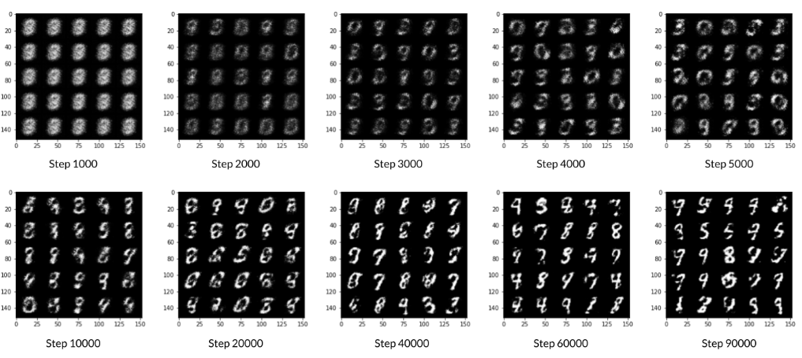

# Digit-Generator-Basic-GAN
Created a very basic generative adversarial network (GAN). Specifically, trained a GAN that can generate hand-written images of digits (0-9) using world famous MNIST Dataset. I used Pytorch to train the model, if you are not familiar with Pytorch, you can take help from official documentation of pytorch on their website.

## Dataset

The training images my discriminator used is from a dataset called MNIST. It contains 60,000 images of handwritten digits, from 0 to 9, like these:

You may notice that the images are quite pixelated -- this is because they are all only 28 x 28! The small size of its images makes MNIST ideal for simple training. Additionally, these images are also in black-and-white so only one dimension, or "color channel", is needed to represent them.

## Training

For training, I processed the entire dataset in batches for every epoch. For every batch, I also updated the discriminator and generator using their loss. Batches are sets of images that will be predicted on before the loss functions are calculated (instead of calculating the loss function after each image). Note that you may see a loss to be greater than 1, this is okay since binary cross entropy loss can be any positive number for a sufficiently confident wrong guess.

It’s also often the case that the discriminator will outperform the generator, especially at the start, because its job is easier. It's important that neither one gets too good (that is, near-perfect accuracy), which would cause the entire model to stop learning. Balancing the two models is actually remarkably hard to do in a standard GAN.

You should roughly expect to see this progression. On a GPU, this should take about 15 seconds per 500 steps, on average, while on CPU it will take roughly 1.5 minutes: 

## Results

After training, the results looks like this. Right one is the original image and the left one is the generated image. Not quite great right? Yeah, it is because it is a very basic GAN and I didn't appply any pre-processing and training methods on that. But overall it worked quite well and generated digits are readable to human eyes. 

.png) .png)
